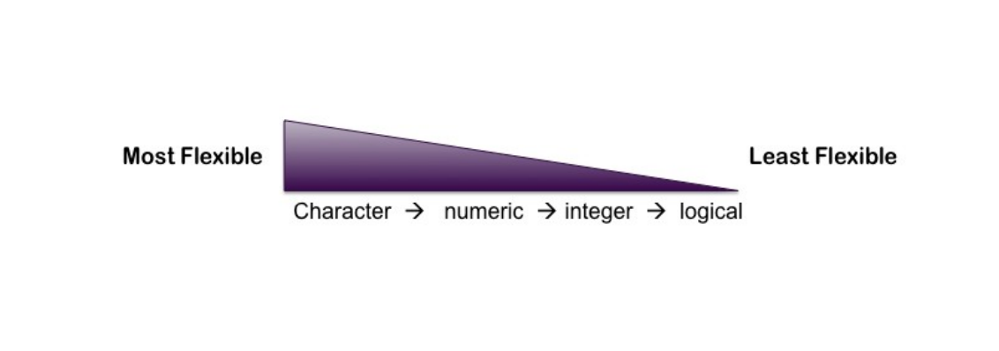

R is an interactive object oriented language. 
# R as a Calculator

## Basic math
```{r math}
1 + 1
1 - 1
1 * 2
4 / 2
(1 + 2 + 3 + 4)/ 4
```

## Assignment operators
```{r assigment}
x  <- 1:50
x

# this is the same, but discouraged as it may be confusing.
x = 1:50
```


# Data Structures

```{r , results='asis', message=FALSE}
library(ztable)
options(ztable.type="html")
tab_data <- data.frame(Dimension=c("1d", "2d", "nd"), 
                       Homogeneous=c("Atomic vector", "Matrix", "Array"),
                       Heterogeneous=c("List", "Data frame", ""))
ztable(tab_data, caption="Table 1: Types of data structures by number of dimensions")
```

Data structures in R are organized by their dimensionality [1d, 2d, nd; @wickham2014advanced], and whether the elements of the data structure are homogeneous or not (see Table 1).

## Vectors

A vector is a 1 dimensional (1d) data structure of homogeneous elements. In R scalars are considered 1 element vectors.

```{r}
x  <- 1
x
is.vector(x)
```


```{r}
   x <- c(1, 2, 3)
 integer.vector <- c(1L, 2L, 9L, 17L)
 integer.vector
 logical.vector <- c(TRUE, FALSE, T, F) 
 logical.vector
 character.vector <- c("Tabatha", "Selina", "Antone", "Beryl", "Cathleen")
 character.vector
 numeric.vector <- c(1, 3.14, 5.11, 12)
 numeric.vector
```



### Coercion

```{r}
y <- c(1L, TRUE, 3L)
typeof(y)
y2 <- c(1L, TRUE, 3L, 3.4)
typeof(y2)
y3 <- c(1L, TRUE, 3L, 3.4, "blue")
typeof(y3)
```

## Matrices

A matrix is a 2 dimensional data structure with homogeneous elements.

```{r}
mat <- matrix(1:9, nrow=3)
mat

row.mat <- matrix(1:9, nrow=3, byrow=TRUE)
row.mat
```

# References

